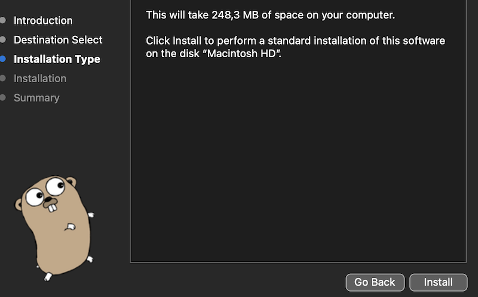
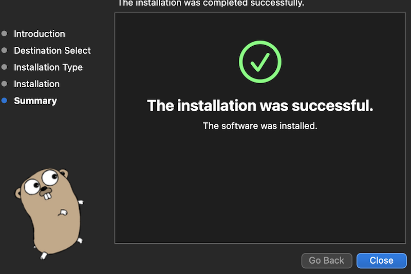
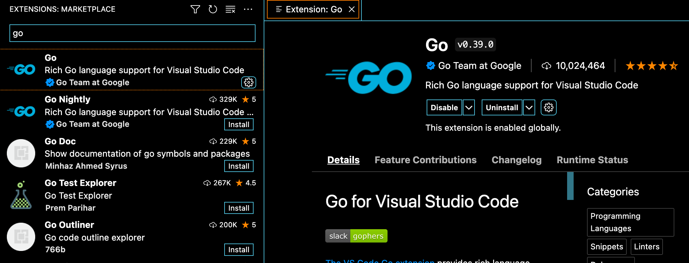

# Day 1 of #66DaysOfGo

_Last update:  Jul 13, 2023_.

---

Today, I've set up:

- This Github repo
- Golang on local computer

---

## Versions used

- macOS Monterrey 12.2
- go: 1.20.6

---

## Setup

### Binaries

- Install [go](https://go.dev/) version [1.20.6 for Intel processor](https://go.dev/dl/go1.20.6.darwin-amd64.pkg) from [Go releases](https://go.dev/dl/).






```bash
$ go version
go version go1.20.6 darwin/amd64
```

### Development

#### VSCode + Go extension from Go Team at Google



#### Guidelines

- Leverage [Google Golang Style Guide](https://google.github.io/styleguide/go/). Define additional specific styles if required.
- Use Interfaces to ease testing.
- For simple unit tests, leverage the standard "testing" library.
- For more complex unit test, to make them readable and easier to mock, use the "testify" library (and its mock package) .
- For AWS development, prefer SDK V2.
- Use a pre-commit file to standardize and automate code checks.

#### Some Golang best practices

1. Effective Package Management: Use Go Modules, which is the standard for package management in Go. It allows versioning and better management of dependencies.
2. Error Handling: Be proactive about error handling. Go has a unique built-in mechanism for handling errors, and it is best practice to handle errors where they occur.
3. Code Formatting and Naming Conventions: Go has several tools for code formatting. As the code scales, tools like https://pkg.go.dev/cmd/gofmt and https://github.com/golang/lint can maintain code standards keeping it readable and maintainable.
4. Interfaces and Composition over Inheritance: Go encourages the use of interfaces and composition over classical inheritance. This makes code more modular, flexible, and easier to test.
5. Testing and Benchmarking: Go has a robust built-in testing tool (but there are several good third party libraries though). Make sure to write unit tests, integration tests, and ideally benchmarks to ensure code is working as expected and assess its performance.
6. Documentation: The [godoc](https://pkg.go.dev/golang.org/x/tools/cmd/godoc) tool can generate documentation from code comments. It is a good practice to write meaningful comments, especially for exported functions, methods, and types.
7. Avoid Global Variables: Global variables can cause problems in concurrent programs and make programs harder to test and reason about. It's best to avoid them whenever possible.
8. Efficient Error Propagation: Don't just throw errors up the call stack. Add context to errors to ease the diagnose. Packages like https://pkg.go.dev/errors can be very helpful.
9. Profiling and Optimizing Performance: Go provides several tools to measure and optimize performance, like benchmark tests, the https://pkg.go.dev/net/http/pprof package, and execution tracer.
10. Concurrency Model: Understand and leverage Go's powerful concurrency model, based on goroutines and channels, allows high performance in I/O and computationally heavy tasks.

#### Some best practices for Unit testing

- Test at the appropriate level: Unit tests should test the smallest unit of code possible – usually a single function. They should not test external dependencies, like databases or APIs.
- Use the "testing" package: Golang has a built-in package called "testing" for writing unit tests. This package provides a consistent way to define and run tests.
- Test coverage: It's recommended to aim for a high level of test coverage, but 100% coverage isn't always necessary (e.g. `main()` function). The goal is to test any function where there's a chance of unexpected behavior.
- Arrange, Act, Assert (AAA): Structuring tests with the AAA pattern can be a good practice. Arrange objects, acting on an object, and then assert that the expected results have occurred.
- Use table-driven tests: Golang supports table-driven tests, which allows to define a table of inputs and expected outputs for a function. This can make tests more concise and easier to read and maintain.
- Use Mocks and Stubs for dependencies: If a function depends on external services, it's best to use mocks and stubs in tests. This ensures that unit tests only test the code and not the behavior of the external dependencies.
- Test edge cases: Ensure to include tests for edge cases. This includes things like inputs at the extreme ends of the range, empty or null inputs, and so on.
- Avoid global states: Global states can make tests harder to write and cause them to break unexpectedly when adding new tests. Always try to keep the tests isolated and predictable.
- Regularly run tests: Make sure to run tests regularly. This is even more beneficial in continuous integration to run tests on every commit (or locally using pre-commit).
- Name tests clearly and descriptively: Test functions should be named in a way that clearly describes what they test. This can make it easier to understand what's being tested and what the expected behavior is.

AWS Development
As of 2023 July, AWS natively supports Golang runtime 1.x for Lambda development.
SDK V2 is recommended. In January 2021, AWS released the SDK for Go Version 2 which requires Go 1.15 or higher.

In the official AWS documentation, more details can be found in the [V2 release notes](https://aws.amazon.com/blogs/developer/aws-sdk-for-go-version-2-general-availability/) and in the [migration guide](https://aws.github.io/aws-sdk-go-v2/docs/migrating/).


#### pre-commit

Instead of relying of individual execution of commands to, for instance, standardize Golang source code formatting, or executing unit tests, etc. it is advisable to configure the [https://pre-commit.com/](https://pre-commit.com/) tool in any Golang Github repository.

The following is a simple pre-commit that do several checks, formatting and run unit tests:

```yaml
# .pre-commit-config.yaml
repos:
  - repo: https://github.com/pre-commit/pre-commit-hooks
    rev: v4.3.0
    hooks:
      - id: trailing-whitespace
      - id: end-of-file-fixer
      - id: check-yaml
      - id: check-added-large-files
  - repo: https://github.com/dnephin/pre-commit-golang
    rev: v0.5.0
    hooks:
      - id: go-fmt
      - id: go-vet
      - id: no-go-testing
      - id: go-unit-tests
```

---

## References

- [(Github) Generating a new SSH key and adding it to the ssh-agent](https://docs.github.com/en/authentication/connecting-to-github-with-ssh/generating-a-new-ssh-key-and-adding-it-to-the-ssh-agent)
- [Golang main site](https://go.dev/)
- [Golang releases](https://go.dev/dl/)
- [Golang Style Guide](https://google.github.io/styleguide/go/)
- [Effective Go](https://go.dev/doc/effective_go)
- [Uber Go Style Guide](https://github.com/uber-go/guide/blob/master/style.md)
- [AWS Go SDK v2](https://aws.github.io/aws-sdk-go-v2/docs/)
- Golang tips:
  - Official doc:
        - [How to write Go Code](https://go.dev/doc/code)
        - [Go Code Review Comments](https://github.com/golang/go/wiki/CodeReviewComments)
        - [Go Test Comments](https://github.com/golang/go/wiki/TestComments)
        - [Common Mistakes](https://github.com/golang/go/wiki/TableDrivenTests)
  - https://github.com/golang/go/wiki/CommonMistakes
  - https://www.agiratech.com/12-best-golang-agile-practices-we-must-follow
  - http://devs.cloudimmunity.com/gotchas-and-common-mistakes-in-go-golang/
  - https://www.bacancytechnology.com/blog/go-best-practices
  - https://go-proverbs.github.io/
  - (Official doc) [Testable examples in Go](https://go.dev/blog/examples)
  - Style guideline for Go packages https://rakyll.org/style-packages/
  - https://dmitri.shuralyov.com/idiomatic-go
  - https://dave.cheney.net/practical-go/presentations/qcon-china.html
  - (As of 2022 Dic) [Comparison of Golang mocking libraries](https://gist.github.com/maratori/8772fe158ff705ca543a0620863977c2)
  - https://www.reddit.com/r/golang/comments/11ke9m7/is_gomock_still_maintained_and_recommended/
