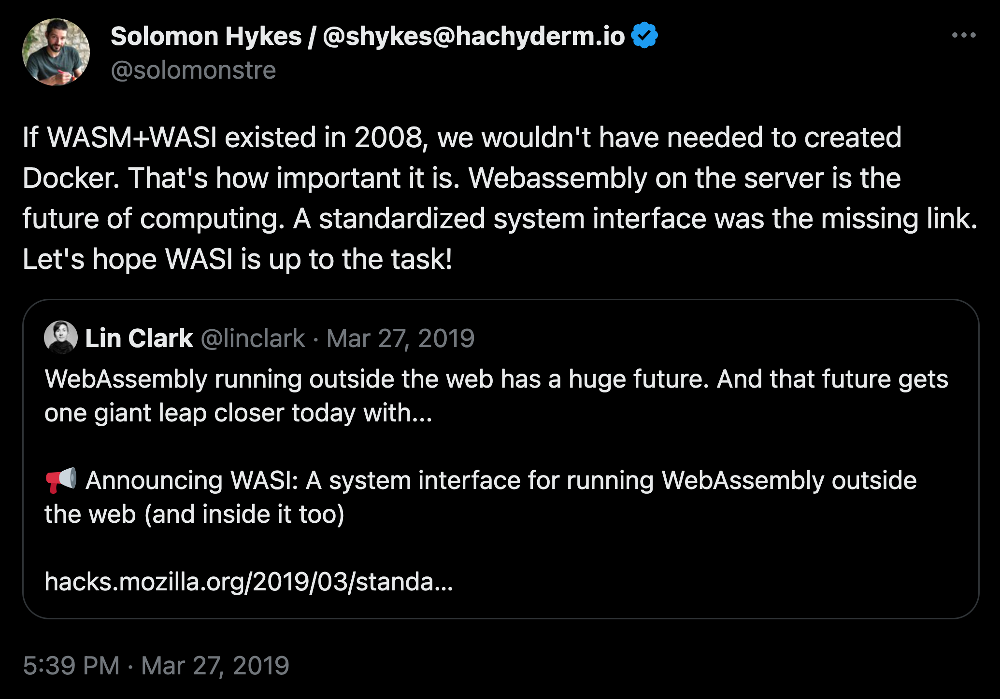

# Day 8 of #66DaysOfGo

_Last update:  Jul 20, 2023_.

---

Today, I've started a new series related to WebAssembly (Wasm).

---

## What is WebAssembly?

WebAssembly, often abbreviated as Wasm, is a binary instruction format designed as a portable target for the compilation of high-level languages like C, C++, Go and Rust. It's designed to be efficient and fast, safe, and platform-independent. It's developed to enable the efficient execution of code in web browsers but is designed to be utilized in other environments as well.

_[https://twitter.com/solomonstre/status/1111004913222324225](https://twitter.com/solomonstre/status/1111004913222324225)_

### Pre-WebAssembly Era (Before 2015)

Web development was primarily reliant on JavaScript for any client-side computation. However, JavaScript wasn't originally designed for heavy computation tasks and performance-critical applications, leading to a demand for a more efficient solution. Technologies like asm.js emerged as a stopgap, allowing developers to write code in languages like C, which was then compiled to a subset of JavaScript that could be executed more efficiently by browsers.

### 2015 - Birth of WebAssembly

Wasm was first announced in a blog post on 17th June 2015. It was developed by a W3C Community Group that included representatives from all major browsers - Google, Microsoft, Mozilla, and Apple. The goal of WebAssembly was to enable high-performance applications on web pages, but the vision expanded to include support for non-web embeddings as well.

### 2016 - Browser Preview

By the end of 2016, the WebAssembly Community Group had representatives from all the major browser vendors. A browser preview was announced, with simultaneous support for WebAssembly in development versions of four major browsers: Chrome, Edge, Firefox, and WebKit.

### 2017 - MVP Release

In March 2017, the initial version (MVP) of WebAssembly was released and was supported in browsers like Chrome, Firefox, and Edge. It was now possible to compile C and C++ code to WebAssembly and run it in the browser. The MVP provided developers with a solid foundation to compile their C/C++ applications to run on the web platform.

### 2018 - Post-MVP Era

Following the release of the MVP, the focus of WebAssembly's development shifted towards extending the capabilities of WebAssembly, including features like threads, garbage collection, and ES module integration.

### 2019 and Beyond

WebAssembly continued to evolve, with increasing adoption by developers. One significant development was the emergence of languages like Rust and Go that can compile to WebAssembly, expanding the options for developers beyond C and C++. The vision for WebAssembly also expanded beyond the web, with use cases emerging in areas like edge computing and portable CLI tools.

## Benefits and Drawbacks of Wasm

### Main benefits of WebAssembly

- **Performance**: WebAssembly is designed to be fast, providing near-native performance. This makes it a great option for performance-critical web applications, like games, computer graphics, real-time video encoding and decoding, etc.
- **Language support**: WebAssembly provides a compact binary format that serves as a compilation target for a variety of languages. This means you can write in languages like C++, Rust, or Go and then compile your code to WebAssembly to run in the browser.
- **Security**: WebAssembly is designed to be "_sandboxed_" and run in a safe execution environment. This could make it a compelling option in cloud environments, where you could execute untrusted code with less risk.
- **Portability**: The Wasm binary runs in a virtual machine which is platform-independent. This means developers can compile their code once and run it on many different types of machines.

### Some drawbacks of WebAssembly

- **Not direct interaction with the DOM**: All must flow through JavaScript interop.
- **Limited access to Web APIs**: While you can call JavaScript functions from WebAssembly, the direct access to the Web APIs is restricted. That means you'll need to write a JavaScript "glue code" to access the DOM or other Web APIs, which can complicate the development process.
- **Lack of Garbage Collection**: WebAssembly does not have built-in garbage collection.  Because Wasm does not possess native memory management, it relies on the underlying code in the original programming language to provide memory management features.
- **Debugging difficulties**: Debugging WebAssembly code can be harder than debugging JavaScript, as browser DevTools are not yet fully adapted to WebAssembly debugging.
- **Security considerations**: Wasm has been criticized for allowing greater ease of hiding the evidence for malware writers, scammers and phishing attackers.

## WebAssembly and Golang

Using Golang to write Wasm largely depends on the specific use case. The main advantage of using Go is that you can use the same language for both the front-end (compiled to Wasm) and back-end development. This can simplify the stack.

Moreover, Golang is a statically typed, compiled language, which can lead to performance benefits. It has a powerful standard library and is well-regarded for its simplicity and efficiency. The Go programming model makes it easy to design and architect large systems, and it has robust support for concurrency.

---

## References

- [https://webassembly.org/](https://webassembly.org/)
- [(Wikipedia) WebAssembly](https://en.wikipedia.org/wiki/WebAssembly)
- [Wasm use cases](https://webassembly.org/docs/use-cases/)
- [(Mozilla) WebAssembly Concepts)](https://developer.mozilla.org/en-US/docs/WebAssembly/Concepts)
- [Wasm by Example](https://Wasmbyexample.dev/home.en-us.html)
- [TinyGo (Go on embedded systems and WebAssembly)](https://tinygo.org/)
- [The LLVM Compiler Infrastructure](https://llvm.org/)
- [(Medium) Wasm in Golang for JavaScript developers](https://medium.com/free-code-camp/webassembly-with-golang-is-fun-b243c0e34f02)
- [WebAssembly and Go: A guide to getting started](https://thenewstack.io/webassembly-and-go-a-guide-to-getting-started-part-1/)
- [Introduction to WebAssembly in Go](https://www.makeuseof.com/intro-to-webassembly-in-go/)
- [(Github) Awesome Wasm](https://github.com/mbasso/awesome-wasm)
- [(As of 2023-07-20) Wasm Garbage Collection proposal is still open](https://github.com/WebAssembly/proposals/issues/16)
- [WebAssembly architecture for Go](https://docs.google.com/document/d/131vjr4DH6JFnb-blm_uRdaC0_Nv3OUwjEY5qVCxCup4/edit)
