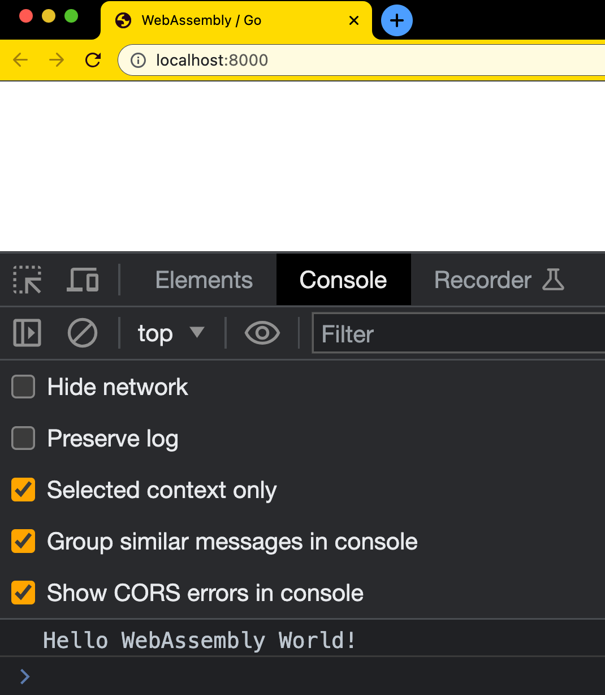
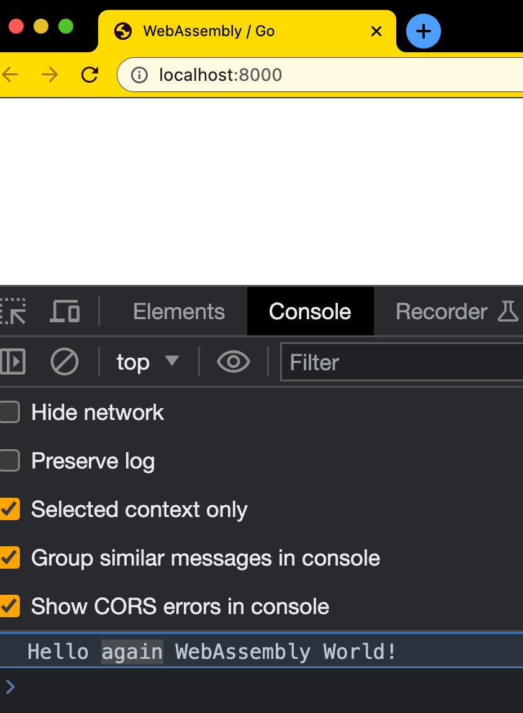

# Day 9 of #66DaysOfGo

_Last update:  Jul 21, 2023_.

---

Today, I've continued with the WebAssembly series, doing a simple Hello World!

---

## Versions used

- macOS Monterrey 12.2
- go: 1.20.6
- python v3

---

## Setup

- Ensure you have the environment variable GOROOT already set.
- Run a simple webserver in your local. In my case I've used the python built-in. Be mindful that it caches the .wasm file.

### Hello World program

> _Based on [https://github.com/golang/go/wiki/WebAssembly](https://github.com/golang/go/wiki/WebAssembly)_

Create a simple go program

```go
// main.go
package main

import "fmt"

func main() {
    fmt.Println("Hello WebAssembly World!")
}
```

To build the package and produce an executable WebAssembly module file named `main.wasm`, set `GOOS=js` and `GOARCH=wasm` environment variables to compile for WebAssembly.

```bash
GOOS=js GOARCH=wasm go build -o main.wasm
# You may face the issue:
#    go: cannot find main module, but ...
#    to create a module there, run:
#    go mod init
```

> _To build, you need a .mod file. Just run `go mod init`_

```bash
# this will create a go.mod file in your local directory
go mod init example.com
```

```bash
$ cat go.mod
module example.com

go 1.20
```

Now the building process will work

```bash
GOOS=js GOARCH=wasm go build -o main.wasm
```

The `main.wasm` file will be refereed into an HTML file. To execute it in a browser, a Javascript support file is needed.

```bash
cp "$(go env GOROOT)/misc/wasm/wasm_exec.js" .
```

Create an `index.html` file.

```html
<!DOCTYPE html>
<html lang="en-US" xml:lang="en-US">
  <head>
    <title>WebAssembly / Go</title>
    <meta charset="utf-8"/>
    <script src="wasm_exec.js"></script>
    <script>
      const go = new Go();
      WebAssembly.instantiateStreaming(fetch("main.wasm"), go.importObject).then((result) => {
        go.run(result.instance);
      });
    </script>
  </head>
  <body></body>
</html>
```

Run a webserver locally reading files from the local directory where the .js and .html file are located.

For instance:

```bash
$ python3 -m http.server
Serving HTTP on :: port 8000 (http://[::]:8000/) ...
```

If you open [http://localhost:8000](http://localhost:8000) on your browser (e.g. Google Chrome), you'll see a blank page.

But if see the console, you'll notice the message from the .go program.



```bash
$ python3 -m http.server
Serving HTTP on :: port 8000 (http://[::]:8000/) ...
::1 - - [21/Jul/2023 23:10:20] "GET / HTTP/1.1" 304 -
::1 - - [21/Jul/2023 23:10:21] "GET /main.wasm HTTP/1.1" 304 -
```

Now, you can rebuild the .wasm file while trying to display a new message.

```go
// main.go
func main() {
    // added "again"
    fmt.Println("Hello again WebAssembly World!")
}
```

```bash
GOOS=js GOARCH=wasm go build -o main.wasm
```

> Since I'm using `python http.server` I need to clear the browser cache to validate the updated message is indeed displayed on the console.

```bash
$ python3 -m http.server
Serving HTTP on :: port 8000 (http://[::]:8000/) ...
```



---

## References

- [(Go in Github) WebAssembly](https://github.com/golang/go/wiki/WebAssembly)
- https://medium.com/free-code-camp/webassembly-with-golang-is-fun-b243c0e34f02
