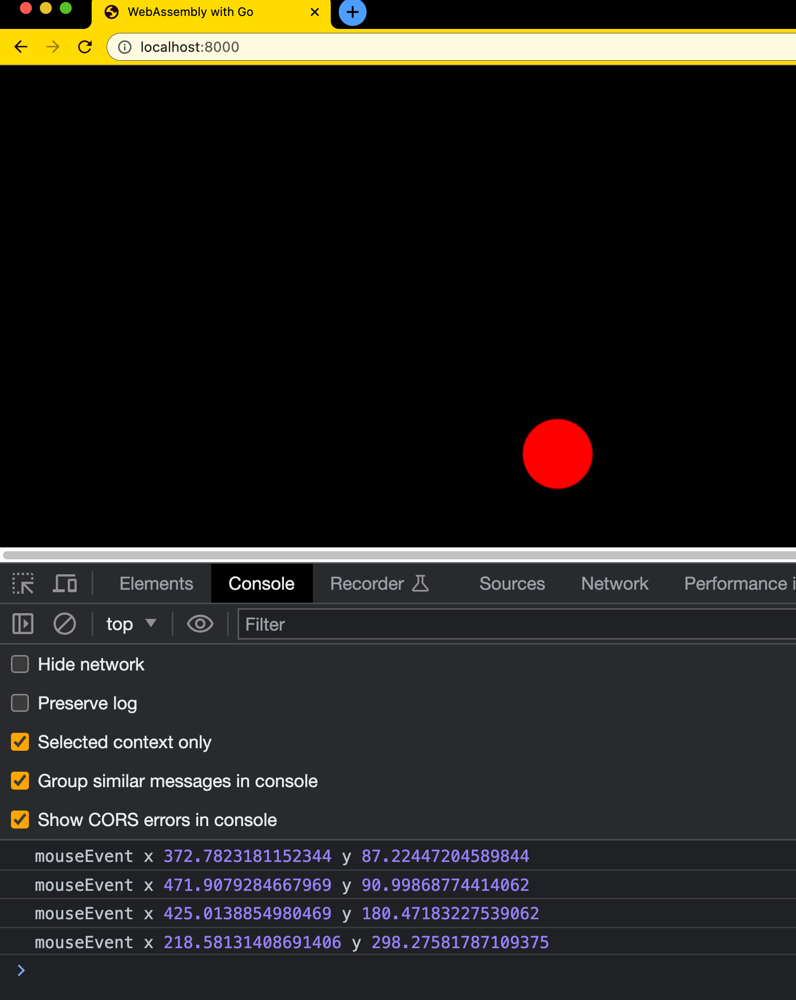

# Day 11 of #66DaysOfGo

_Last update:  Jul 23, 2023_.

---

Today, I've continued with the WebAssembly series, this time understanding an approach to manipulate the DOM structure using Go.

---

## Versions used

- macOS Monterrey 12.2
- go: 1.20.6
- python v3

---

## Background

> _Based on [https://medium.com/free-code-camp/webassembly-with-golang-is-fun-b243c0e34f02](https://medium.com/free-code-camp/webassembly-with-golang-is-fun-b243c0e34f02)_ by [Martin Olsansky](https://olso.space/).


### Go program

Create an `index.html` file.

- For those who are, like me, not familiar with Javascript, the `setTimeout` sets a timer that executes a function once the timer expires. Even though the default is 0 milliseconds, it doesn't mean the function will run instantly but as soon as possible (ensuring the browser has finished loading the script).
- `WebAssembly.instantiate(buffer, go.importObject)`: This compiles and instantiates the WASM binary using the ArrayBuffer object (representing the WASM file's data) from the fetched WASM file and the importObject from the Go instance.

```html
<!DOCTYPE html>
<html lang="en-US" xml:lang="en-US">
  <head>
    <title>WebAssembly with Go</title>
    <meta charset="utf-8" />
    <meta name="viewport" content="width=device-width,initial-scale=1.0" />
    <style>body{height:100%;width:100%;padding:0;margin:0;background-color:#000000;color:#FFFFFF;font-family:Arial,Helvetica,sans-serif}</style>
    <script type="text/javascript" src="./wasm_exec.js"></script>
    <script type="text/javascript">
      async function run(fileUrl) {
        try {
          const file = await fetch(fileUrl);
          const buffer = await file.arrayBuffer();
          const go = new Go();
          const { instance } = await WebAssembly.instantiate(buffer, go.importObject);
          go.run(instance);
        } catch (err) {
          console.error(err);
        }
      }
      setTimeout(() => run("./game.wasm"));
    </script>
  </head>
  <body></body>
</html>
```

Use the Go code of in [main.go](./main.go) (provided by Martin Olsansky).

A few comments about the Go code:

- Window setup: It retrieves the global window object along with the document and body. Then, it sets up a canvas that matches the window's size and appends it to the body. The setup() function also initializes the audio element for a beep sound and sets up the context for drawing the laser.
- Game state: It defines the gameState struct, which tracks the current position and movement direction of the laser, as well as its size.
- Rendering: The updateGame() function is the main game loop that's called repeatedly using the browser's requestAnimationFrame function. It moves the laser, checks for collisions with the window edges, and draws the laser.
- Event handling: The updatePlayer() function handles mouse/touch events. If the event coordinates match the current laser position (as determined by the isLaserCaught() function), it triggers the beep sound and device vibration.
- Blocking forever: It uses an empty channel (runGameForever) to prevent the main function from terminating. The program runs indefinitely because there's never any data sent on the channel to unblock the <-runGameForever operation.

Build the .wasm:

```bash
cp "$(go env GOROOT)/misc/wasm/wasm_exec.js" .
GOOS=js GOARCH=wasm go build -o game.wasm main.go
```

Run a local Web server and load the index.html page.

```bash
$ python3 -m http.server
Serving HTTP on :: port 8000 (http://[::]:8000/) ...
```

Open http://localhost:8000

You should see something like:



---

## References

- [(Go in Github) WebAssembly](https://github.com/golang/go/wiki/WebAssembly)
- [https://medium.com/free-code-camp/webassembly-with-golang-is-fun-b243c0e34f02](https://medium.com/free-code-camp/webassembly-with-golang-is-fun-b243c0e34f02)
- [https://docs.docker.com/desktop/install/mac-install/](https://docs.docker.com/desktop/install/mac-install/)
