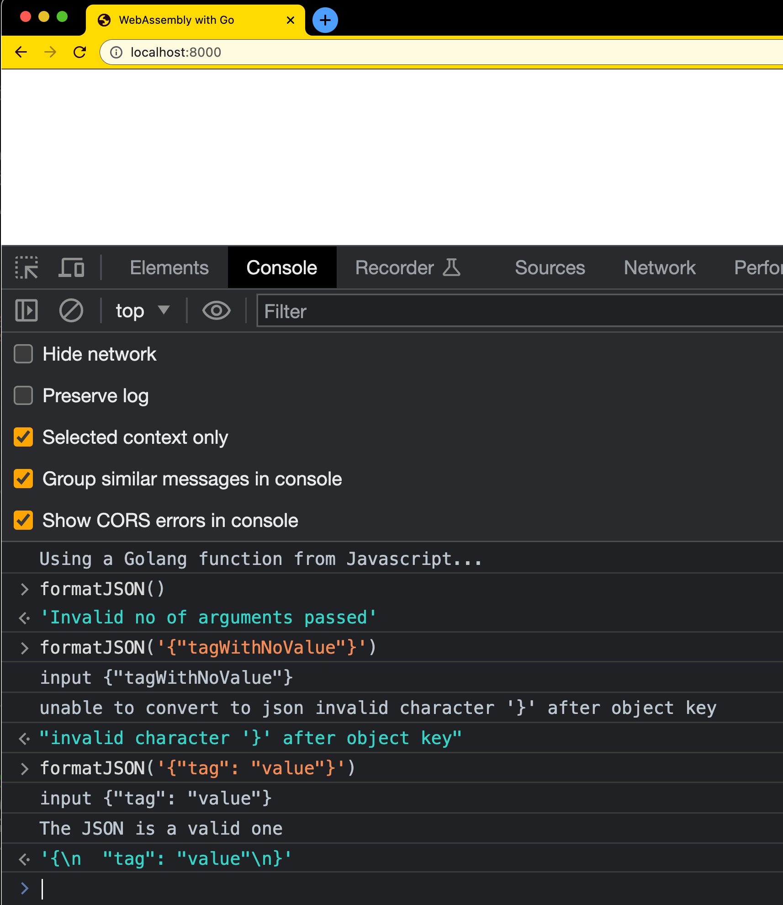

# Day 12 of #66DaysOfGo

_Last update:  Jul 24, 2023_.

---

Today, I've continued with the WebAssembly series, this time understanding how to use a Golang function from the Browser console.

---

## Versions used

- macOS Monterrey 12.2
- go: 1.20.6
- python v3

---

## Background

> _Based on [https://golangbot.com/webassembly-using-go/](https://golangbot.com/webassembly-using-go/)_ by [Naveen Ramanathan](http://twitter.com/msgtonaveen).


### Go program

Create an `index.html` file similar to the one created in [day 9](../day09/index.html).

```html
<!DOCTYPE html>
<html lang="en-US" xml:lang="en-US">
  <head>
    <title>WebAssembly with Go</title>
    <meta charset="utf-8"/>
    <script src="wasm_exec.js"></script>
    <script>
      const go = new Go();
      WebAssembly.instantiateStreaming(fetch("json.wasm"), go.importObject).then((result) => {
        go.run(result.instance);
      });
    </script>
  </head>
  <body></body>
</html>
```

Use the Go code of in [main.go](./main.go) (provided by Naveen Ramanathan).

A few comments about the Go code:

- It has a function called `prettyJson` that takes a json as string. If the json is valid, it returns a formatted json. Otherwise an error.
- The function called `jsonWrapper` encapsulates the previous one to be exported an used by Javascript.
  - I've added the line `fmt.Println("The provided JSON is a valid one")` after a successful json read.
- In the `main` function, this line do the magic: `js.Global().Set("formatJSON", jsonWrapper())` where `formatJSON` can be used directly from the browser console. And, as usual, the code `<-make(chan bool)` allows to run the program indefinitely.

```go
func jsonWrapper() js.Func {
    jsonFunc := js.FuncOf(func(this js.Value, args []js.Value) any {
        if len(args) != 1 {
            return "Invalid no of arguments passed"
        }
        inputJSON := args[0].String()
        fmt.Printf("input %s\n", inputJSON)
        pretty, err := prettyJson(inputJSON)
        if err != nil {
            fmt.Printf("unable to convert to json %s\n", err)
            return err.Error()
        }
        fmt.Println("The provided JSON is a valid one")
        return pretty
    })
    return jsonFunc
}

func prettyJson(input string) (string, error) {
    var raw any
    if err := json.Unmarshal([]byte(input), &raw); err != nil {
        return "", err
    }
    pretty, err := json.MarshalIndent(raw, "", "  ")
    if err != nil {
        return "", err
    }
    return string(pretty), nil
}

func main() {
    fmt.Println("Using a Golang function from Javascript...")
    js.Global().Set("formatJSON", jsonWrapper())
    <-make(chan bool)
}
```

Build the .wasm:

```bash
cp "$(go env GOROOT)/misc/wasm/wasm_exec.js" .
GOOS=js GOARCH=wasm go build -o json.wasm main.go
```

Run a local Web server and load the index.html page.

```bash
$ python3 -m http.server
Serving HTTP on :: port 8000 (http://[::]:8000/) ...
```

Open http://localhost:8000

Then go to the console. If you execute for instance:

- `formatJSON()` (i.e. with no parameters) you should expect an error.
- `formatJSON('{"tagWithNoValue"}')` (i.e. invalid json) you should also expect an error.
- `formatJSON('{"tag": "value"}')` (i.e. a valid json) you should see a success message.

You should see something like:



---

## References

- [WebAssembly: Introduction to WebAssembly using Go](https://golangbot.com/webassembly-using-go)
- [golangbot.com](https://golangbot.com)
