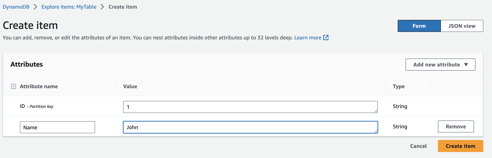

# Day 14 of #66DaysOfGo

_Last update:  Jul 26, 2023_.

---

Today, I've continued with the AWS series, this time working with the AWS SDK v2 for Go by reading an item from a DynamoDB table.

---

## Versions used

- macOS Monterrey 12.2
- go: 1.20.6
- npm: 6.14.6
- serverless: 3.33.0
- aws-cli: 2.0.38
- jq: 1.6

---

## V2 vs V1 SDK

V2 offers significant performance improvements in CPU and memory utilization over version 1.

In summary, here there are some of the advantages:

- Performance: AWS SDK for Go V2 generally offers improvements over V1. It was rearchitected with a focus on performance, which can result in better application efficiency. SDK v2 generates type specific serializers and deserializers, eliminating the need for runtime-based reflection. Eliminating reflection results in a marked improvement in CPU and memory utilization when using the API clients.
- Improved Modularity: V2 is more modular than its predecessor, making it easier to control what parts of the SDK to import into the application. With the modular approach, each AWS service gets its own Go module, allowing for leaner applications.
- Better Error Handling: V2 provides a new error handling mechanism that makes it easier to work with and categorize AWS errors.
- API Refactoring: The API has been refactored to make it more idiomatic to Go, making the SDK more consistent and easier to use.
- Configuration Loading: It has an improved configuration setup, which provides more flexible and powerful configuration loading options.
- Improved Pagination: AWS SDK for Go V2 provides a simplified method of handling paginated operations.
- Context Integration: V2 SDK also integrates with the Go context package, making it easier to control cancellation of requests and pass additional metadata.
- Middleware Feature: The SDK's middleware feature makes it easier to modify SDK behavior or add custom behaviors.

---

## Setup project

As in [day 13](../day13/):

- Create a Golang sample project using the Serverless framework
- In the serverless manifest (serverless.yml) make a few changes:
  - Comment out the line `- '!./**'`
  - Change the API type from HTTP to Rest API by modifying the lines `httpApi` to `http`.

```bash
serverless create --template aws-go --path test-aws-go
```

## Use the V2 SDK

- Temporarily, to keep things simple, there will be no modules in the Golang code, but a single file with an AWS Lambda function reading an item from a DynamoDB table. Check the code within the [hello](./test-aws-go/hello/main.go) directory.
- In the serverless manifest:
  - A DynamoDB table was added in the `Resources` section. Notice that is using an on demand mode (Pay per request). It has a primary key called "ID". The table was populated manually for testing purposes.
  - Only a single lambda function is left.
  - The default API Gateway - Lambda integration method is Lambda proxy.
  - The Endpoint is receiving the `id` (dynamodb table primary key) as path parameter (`path: /hello/{id}`)
  - The Makefile contains only one line in the building section.

## Testing

Run the following commands:

```bash
go mod init example.com
go get -v all
make deploy
```

Manually insert items into the table.





```bash
curl -s -X GET https://1c6jdk2rxb.execute-api.us-east-1.amazonaws.com/dev/hello/1 | jq .
{
  "id": "1",
  "name": "John"
}
```

```bash
curl -s -X GET https://1c6jdk2rxb.execute-api.us-east-1.amazonaws.com/dev/hello/2 | jq .
{
  "id": "2",
  "name": "Paul"
}
```

## Cleanup

```bash
serverless remove
```

---

## References

- [AWS Go SDK v2](https://aws.github.io/aws-sdk-go-v2/docs/)
- [AWS Go SDK V2 release notes](https://aws.amazon.com/blogs/developer/aws-sdk-for-go-version-2-general-availability/)
- [AWS Go SDK migration guide](https://aws.github.io/aws-sdk-go-v2/docs/migrating/)
- [AWS benchmark program using Amazon DynamoDB client](https://github.com/aws/aws-sdk-go-v2/tree/main/service/internal/benchmark/dynamodb)
