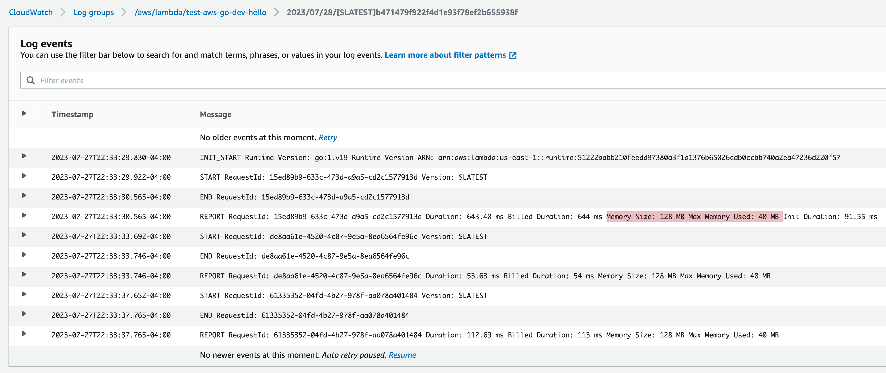
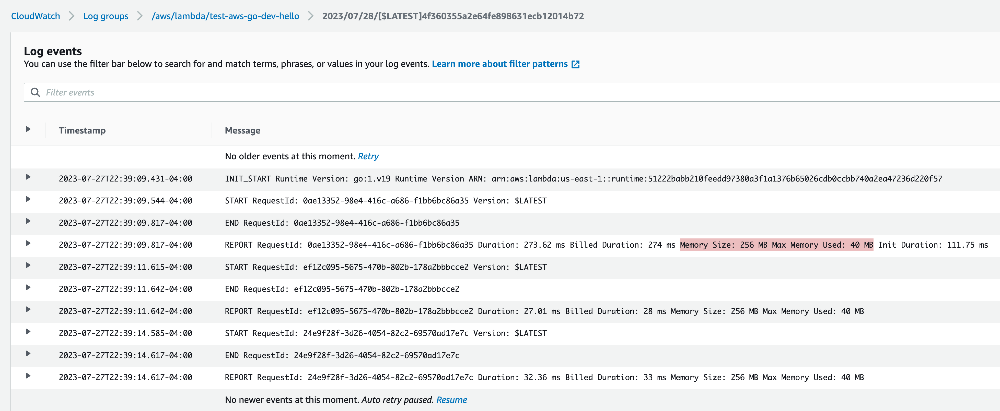
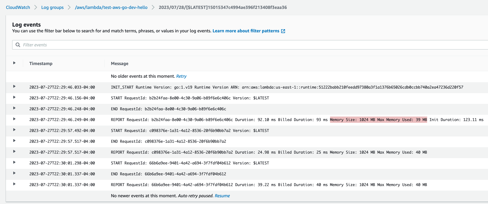

# Day 15 of #66DaysOfGo

_Last update:  Jul 27, 2023_.

---

Today, I've continued with the AWS series, moving the Lambda function project from the previous day into modules.

---

## Versions used

- macOS Monterrey 12.2
- go: 1.20.6
- npm: 6.14.6
- serverless: 3.33.0
- aws-cli: 2.0.38
- jq: 1.6

---

## Setup project

- Copy the folder `test-aws-go` from [day 14](../day14/)
- Move the golang source code from the `hello` directory to `test-aws-go`
- Modify the Makefile to retrieve the source code from the directory `test-aws-go` (instead of `hello`)
- Set a RAM memory to the Lambda function in the serverless.yml manifest (default: 1024)

## Splitting into modules

The main function would like like:

```go
package main

import (
    "myapp/handler"

    "github.com/aws/aws-lambda-go/lambda"
)

func main() {
    lambda.Start(handler.HandleRequest)
}
```

And the handler:

```go
// ...
// shortened for brevity
func HandleRequest(ctx context.Context, request Request) (Response, error) {
    item, err := db.GetItem(ctx, request.PathParameters["id"])
    if err != nil {
        return handleError(err)
    }
// ...
// shortened for brevity
```

And the db:

```go
// ...
// shortened for brevity

type Item struct {
    ID   string `json:"id"`
    Name string `json:"name"`
}

func GetItem(ctx context.Context, id string) (*Item, error) {
    cfg, err := config.LoadDefaultConfig(ctx)
// ...
// shortened for brevity
```

## Build

> Ideally, every Golang project should be in its own repository.

```bash
go mod init myapp
go mod tidy
```

```bash
$ make deploy
# ...
# shortened for brevity
# ...
✔ Service deployed to stack test-aws-go-dev (45s)

endpoint: GET - https://uytjwexx30.execute-api.us-east-1.amazonaws.com/dev/hello/{id}
functions:
  hello: test-aws-go-dev-hello (3.9 MB)
```

## Testing

Manually insert items into the table, as in the [day 14](../day14/).

```bash
curl -s -X GET https://uytjwexx30.execute-api.us-east-1.amazonaws.com/dev/hello/1 | jq .
{
  "id": "1",
  "name": "John"
}
```

```bash
curl -s -X GET https://uytjwexx30.execute-api.us-east-1.amazonaws.com/dev/hello/1 | jq .
{
  "id": "2",
  "name": "Paul"
}
```

## Cleanup

```bash
serverless remove
```

---

## Takeaways

Since Golang is an efficient language, it consumes less memory than other languages (e.g. Java), however, more memory is more compute power in AWS. You can test the performance and optimize the RAM memory needed accordingly. You can also try an automated tool such as [Power Tuning](https://docs.aws.amazon.com/lambda/latest/operatorguide/profile-functions.html).







---

## References

- [https://docs.aws.amazon.com/lambda/latest/operatorguide/profile-functions.html](https://docs.aws.amazon.com/lambda/latest/operatorguide/profile-functions.html)
