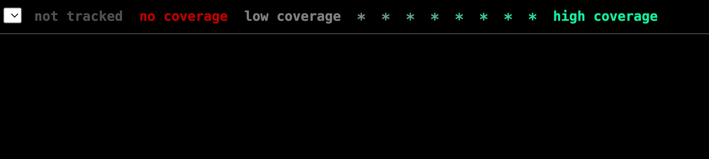

# Day 16 of #66DaysOfGo

_Last update:  Jul 29, 2023_.

---

Today, I've started a new series related to testing with Go.

---

## Versions used

- macOS Monterrey 12.2
- go: 1.20.6

---

## Setup project

Clone the following repo which is based on [day 15](../day15/):

```bash
BRANCH=notest
git clone --single-branch --branch ${BRANCH} https://github.com/jp-chl/test-go-aws-dynamo.git
```

## Calculating Unit test coverage

Once in the repo, run the following commands:

```bash
$ go test -v -coverprofile /tmp/cover.out ./src/...
?   	github.com/jp-chl/test-go-aws-dynamo/src	[no test files]
?   	github.com/jp-chl/test-go-aws-dynamo/src/handler	[no test files]
?   	github.com/jp-chl/test-go-aws-dynamo/src/db	[no test files]
```

```bash
go tool cover -html /tmp/cover.out -o /tmp/cover.html
```bash

Open the report

```bash
open /tmp/cover.html
```

Obviously coverage is 0% :sweat_smile:




## References

- [https://quii.gitbook.io/learn-go-with-tests/go-fundamentals/hello-world](https://quii.gitbook.io/learn-go-with-tests/go-fundamentals/hello-world)
