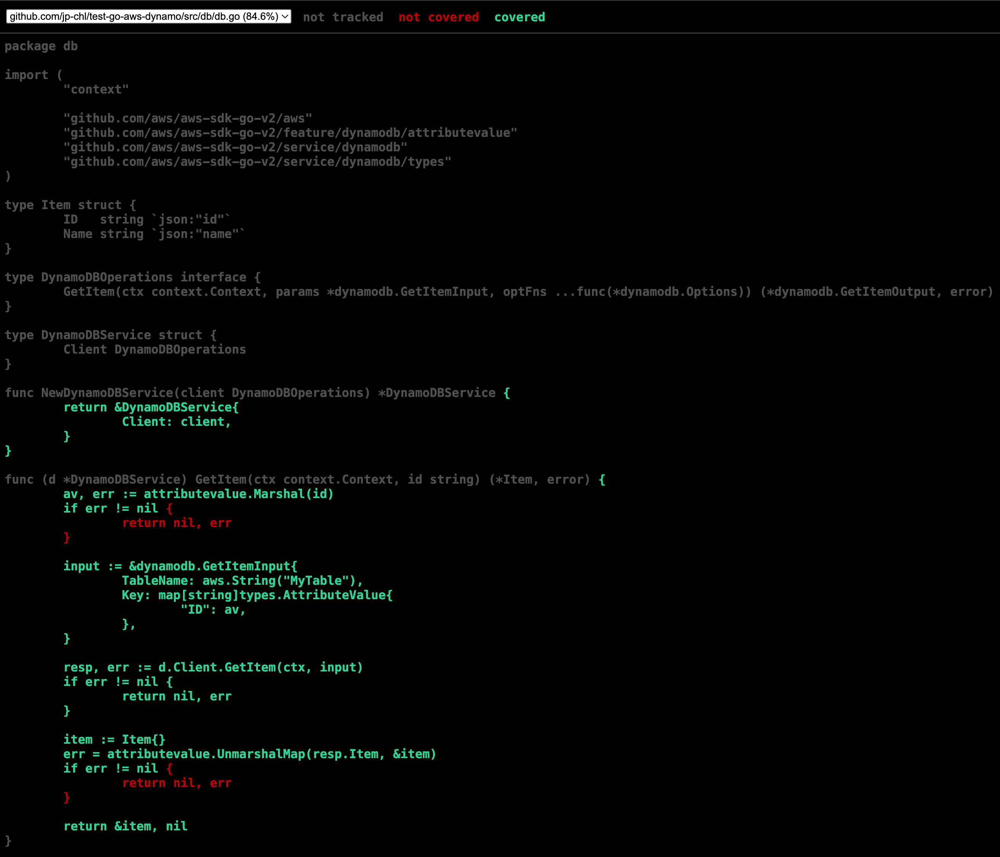
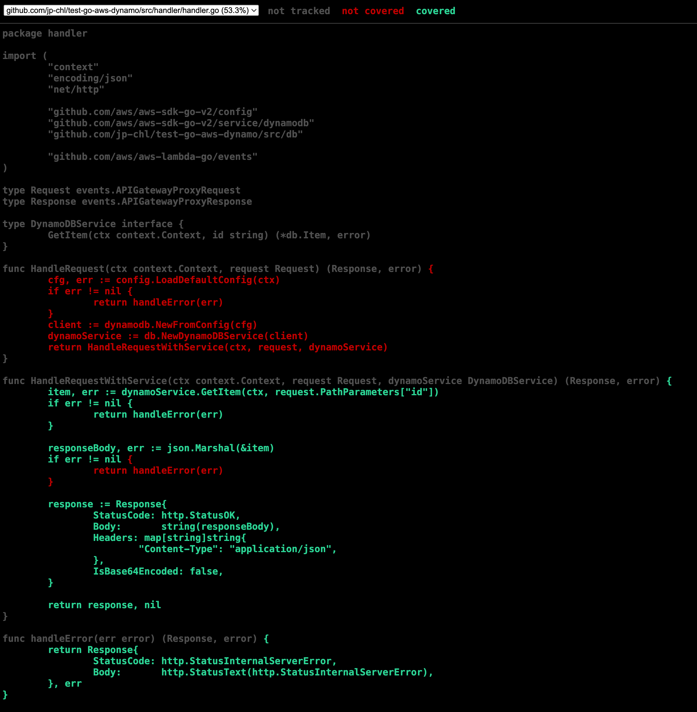

# Day 17 of #66DaysOfGo

_Last update:  Jul 29, 2023_.

---

Today, I've continued with the testing series, by adding Unit tests to an AWS Lambda code in the handler and db layers.

---

## Versions used

- macOS Monterrey 12.2
- go: 1.20.6

---

## Setup project

Clone the following repo which is based on [day 15](../day15/):

```bash
BRANCH=test
git clone --single-branch --branch ${BRANCH} https://github.com/jp-chl/test-go-aws-dynamo.git
```

## Make the code more testable by adding Interfaces

Either in `handler.go` and `db.go`, Interfaces were added to mock the services.

```go
// handler.go
package handler

import (
    "context"
    "encoding/json"
    "net/http"

    "github.com/aws/aws-sdk-go-v2/config"
    "github.com/aws/aws-sdk-go-v2/service/dynamodb"
    "github.com/jp-chl/test-go-aws-dynamo/src/db"

    "github.com/aws/aws-lambda-go/events"
)

type Request events.APIGatewayProxyRequest
type Response events.APIGatewayProxyResponse

type DynamoDBService interface {
    GetItem(ctx context.Context, id string) (*db.Item, error)
}

func HandleRequest(ctx context.Context, request Request) (Response, error) {
    cfg, err := config.LoadDefaultConfig(ctx)
    if err != nil {
        return handleError(err)
    }
    client := dynamodb.NewFromConfig(cfg)
    dynamoService := db.NewDynamoDBService(client)
    return HandleRequestWithService(ctx, request, dynamoService)
}

func HandleRequestWithService(ctx context.Context, request Request, dynamoService DynamoDBService) (Response, error) {
    item, err := dynamoService.GetItem(ctx, request.PathParameters["id"])
    if err != nil {
        return handleError(err)
    }

    responseBody, err := json.Marshal(&item)
    if err != nil {
        return handleError(err)
    }

    response := Response{
        StatusCode: http.StatusOK,
        Body:       string(responseBody),
        Headers: map[string]string{
            "Content-Type": "application/json",
        },
        IsBase64Encoded: false,
    }

    return response, nil
}

func handleError(err error) (Response, error) {
    return Response{
        StatusCode: http.StatusInternalServerError,
        Body:       http.StatusText(http.StatusInternalServerError),
    }, err
}
```go

```go
// db.go
package db

import (
    "context"

    "github.com/aws/aws-sdk-go-v2/aws"
    "github.com/aws/aws-sdk-go-v2/feature/dynamodb/attributevalue"
    "github.com/aws/aws-sdk-go-v2/service/dynamodb"
    "github.com/aws/aws-sdk-go-v2/service/dynamodb/types"
)

type Item struct {
    ID   string `json:"id"`
    Name string `json:"name"`
}

type DynamoDBOperations interface {
    GetItem(ctx context.Context, params *dynamodb.GetItemInput, optFns ...func(*dynamodb.Options)) (*dynamodb.GetItemOutput, error)
}

type DynamoDBService struct {
    Client DynamoDBOperations
}

func NewDynamoDBService(client DynamoDBOperations) *DynamoDBService {
    return &DynamoDBService{
        Client: client,
    }
}

func (d *DynamoDBService) GetItem(ctx context.Context, id string) (*Item, error) {
    av, err := attributevalue.Marshal(id)
    if err != nil {
        return nil, err
    }

    input := &dynamodb.GetItemInput{
        TableName: aws.String("MyTable"),
        Key: map[string]types.AttributeValue{
            "ID": av,
        },
    }

    resp, err := d.Client.GetItem(ctx, input)
    if err != nil {
        return nil, err
    }

    item := Item{}
    err = attributevalue.UnmarshalMap(resp.Item, &item)
    if err != nil {
        return nil, err
    }

    return &item, nil
}
```

For testing, besides the built-in testing package, I've tried also with testify.

These are the test files:

```go
// handler_test.go
package handler

import (
    "context"
    "errors"
    "testing"

    "github.com/jp-chl/test-go-aws-dynamo/src/db"
    "github.com/stretchr/testify/assert"
)

type mockDynamoDBService struct {
    GetItemFunc func(ctx context.Context, id string) (*db.Item, error)
}

func (m *mockDynamoDBService) GetItem(ctx context.Context, id string) (*db.Item, error) {
    return m.GetItemFunc(ctx, id)
}

func TestHandleRequest(t *testing.T) {
    ctx := context.TODO()
    request := Request{PathParameters: map[string]string{"id": "testID"}}

    // Success case
    mockService := &mockDynamoDBService{
        GetItemFunc: func(ctx context.Context, id string) (*db.Item, error) {
            return &db.Item{ID: id, Name: "testName"}, nil
        },
    }

    response, err := HandleRequestWithService(ctx, request, mockService)

    assert.NoError(t, err)
    assert.Equal(t, 200, response.StatusCode)

    // Error case
    mockService = &mockDynamoDBService{
        GetItemFunc: func(ctx context.Context, id string) (*db.Item, error) {
            return nil, errors.New("error getting item")
        },
    }

    _, err = HandleRequestWithService(ctx, request, mockService)

    assert.Error(t, err)
}
```

```go
// db_test.go
package db

import (
    "context"
    "errors"
    "testing"

    "github.com/aws/aws-sdk-go-v2/service/dynamodb"
    "github.com/aws/aws-sdk-go-v2/service/dynamodb/types"
    "github.com/stretchr/testify/assert"
)

type mockDynamoDBClient struct {
    GetItemFunc func(ctx context.Context, params *dynamodb.GetItemInput, optFns ...func(*dynamodb.Options)) (*dynamodb.GetItemOutput, error)
}

func (m *mockDynamoDBClient) GetItem(ctx context.Context, params *dynamodb.GetItemInput, optFns ...func(*dynamodb.Options)) (*dynamodb.GetItemOutput, error) {
    return m.GetItemFunc(ctx, params, optFns...)
}

func TestGetItem(t *testing.T) {
    ctx := context.TODO()
    id := "testID"

    // Success case
    mockClient := &mockDynamoDBClient{
        GetItemFunc: func(ctx context.Context, params *dynamodb.GetItemInput, optFns ...func(*dynamodb.Options)) (*dynamodb.GetItemOutput, error) {
            item := map[string]types.AttributeValue{
                "ID":   &types.AttributeValueMemberS{Value: "testID"},
                "Name": &types.AttributeValueMemberS{Value: "testName"},
            }
            return &dynamodb.GetItemOutput{Item: item}, nil
        },
    }

    service := NewDynamoDBService(mockClient)
    item, err := service.GetItem(ctx, id)

    assert.NoError(t, err)
    assert.Equal(t, id, item.ID)

    // Error case
    mockClient = &mockDynamoDBClient{
        GetItemFunc: func(ctx context.Context, params *dynamodb.GetItemInput, optFns ...func(*dynamodb.Options)) (*dynamodb.GetItemOutput, error) {
            return nil, errors.New("error getting item")
        },
    }

    service = NewDynamoDBService(mockClient)
    _, err = service.GetItem(ctx, id)

    assert.Error(t, err)
}
```

## Run tests

```bash
$ go get -v all
go: downloading github.com/stretchr/testify v1.8.4
go: upgraded github.com/stretchr/testify v1.7.2 => v1.8.4
```

```bash
go mod tidy
```

```bash
go test ./...
?     github.com/jp-chl/test-go-aws-dynamo/src  [no test files]
ok    github.com/jp-chl/test-go-aws-dynamo/src/db  0.537s
ok    github.com/jp-chl/test-go-aws-dynamo/src/handler  0.533s
```

Run the coverage tool

```bash
$ go test -v -coverprofile /tmp/cover.out ./src/...
?     github.com/jp-chl/test-go-aws-dynamo/src  [no test files]
=== RUN   TestGetItem
--- PASS: TestGetItem (0.00s)
PASS
  github.com/jp-chl/test-go-aws-dynamo/src/db  coverage: 84.6% of statements
ok    github.com/jp-chl/test-go-aws-dynamo/src/db  0.758s  coverage: 84.6% of statements
=== RUN   TestHandleRequest
--- PASS: TestHandleRequest (0.00s)
PASS
  github.com/jp-chl/test-go-aws-dynamo/src/handler  coverage: 53.3% of statements
ok    github.com/jp-chl/test-go-aws-dynamo/src/handler  0.913s  coverage: 53.3% of statements
```

```bash
go tool cover -html /tmp/cover.out -o /tmp/cover.html
```

```bash
open /tmp/cover.html
```




