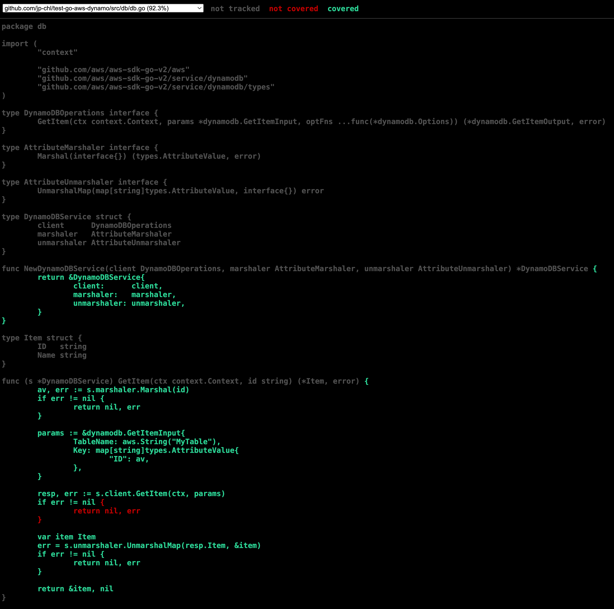
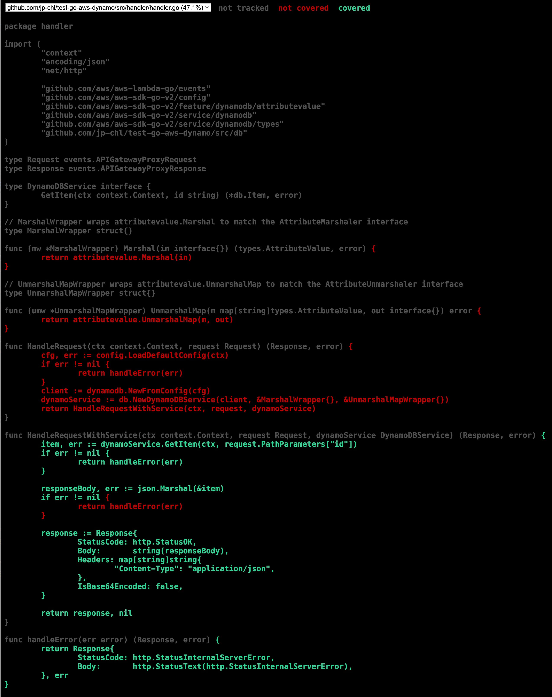

# Day 17 of #66DaysOfGo

_Last update:  Jul 29, 2023_.

---

Today, I've continued with the testing series, by adding more Unit tests to the db package.

---

## Versions used

- macOS Monterrey 12.2
- go: 1.20.6

---

## Setup project

Clone the following repo which is based on [day 16](../day16/):

```bash
BRANCH=test-v2
git clone --single-branch --branch ${BRANCH} https://github.com/jp-chl/test-go-aws-dynamo.git
```

## Refactoring handler and db packages

```go
// db.go
package db

import (
    "context"

    "github.com/aws/aws-sdk-go-v2/aws"
    "github.com/aws/aws-sdk-go-v2/service/dynamodb"
    "github.com/aws/aws-sdk-go-v2/service/dynamodb/types"
)

type DynamoDBOperations interface {
    GetItem(ctx context.Context, params *dynamodb.GetItemInput, optFns ...func(*dynamodb.Options)) (*dynamodb.GetItemOutput, error)
}

type AttributeMarshaler interface {
    Marshal(interface{}) (types.AttributeValue, error)
}

type AttributeUnmarshaler interface {
    UnmarshalMap(map[string]types.AttributeValue, interface{}) error
}

type DynamoDBService struct {
    client      DynamoDBOperations
    marshaler   AttributeMarshaler
    unmarshaler AttributeUnmarshaler
}

func NewDynamoDBService(client DynamoDBOperations, marshaler AttributeMarshaler, unmarshaler AttributeUnmarshaler) *DynamoDBService {
    return &DynamoDBService{
        client:      client,
        marshaler:   marshaler,
        unmarshaler: unmarshaler,
    }
}

type Item struct {
    ID   string
    Name string
}

func (s *DynamoDBService) GetItem(ctx context.Context, id string) (*Item, error) {
    av, err := s.marshaler.Marshal(id)
    if err != nil {
        return nil, err
    }

    params := &dynamodb.GetItemInput{
        TableName: aws.String("MyTable"),
        Key: map[string]types.AttributeValue{
            "ID": av,
        },
    }

    resp, err := s.client.GetItem(ctx, params)
    if err != nil {
        return nil, err
    }

    var item Item
    err = s.unmarshaler.UnmarshalMap(resp.Item, &item)
    if err != nil {
        return nil, err
    }

    return &item, nil
}
```

```go
// handler.go
package handler

import (
    "context"
    "encoding/json"
    "net/http"

    "github.com/aws/aws-lambda-go/events"
    "github.com/aws/aws-sdk-go-v2/config"
    "github.com/aws/aws-sdk-go-v2/feature/dynamodb/attributevalue"
    "github.com/aws/aws-sdk-go-v2/service/dynamodb"
    "github.com/aws/aws-sdk-go-v2/service/dynamodb/types"
    "github.com/jp-chl/test-go-aws-dynamo/src/db"
)

type Request events.APIGatewayProxyRequest
type Response events.APIGatewayProxyResponse

type DynamoDBService interface {
    GetItem(ctx context.Context, id string) (*db.Item, error)
}

// MarshalWrapper wraps attributevalue.Marshal to match the AttributeMarshaler interface
type MarshalWrapper struct{}

func (mw *MarshalWrapper) Marshal(in interface{}) (types.AttributeValue, error) {
    return attributevalue.Marshal(in)
}

// UnmarshalMapWrapper wraps attributevalue.UnmarshalMap to match the AttributeUnmarshaler interface
type UnmarshalMapWrapper struct{}

func (umw *UnmarshalMapWrapper) UnmarshalMap(m map[string]types.AttributeValue, out interface{}) error {
    return attributevalue.UnmarshalMap(m, out)
}

func HandleRequest(ctx context.Context, request Request) (Response, error) {
    cfg, err := config.LoadDefaultConfig(ctx)
    if err != nil {
        return handleError(err)
    }
    client := dynamodb.NewFromConfig(cfg)
    dynamoService := db.NewDynamoDBService(client, &MarshalWrapper{}, &UnmarshalMapWrapper{})
    return HandleRequestWithService(ctx, request, dynamoService)
}

func HandleRequestWithService(ctx context.Context, request Request, dynamoService DynamoDBService) (Response, error) {
    item, err := dynamoService.GetItem(ctx, request.PathParameters["id"])
    if err != nil {
        return handleError(err)
    }

    responseBody, err := json.Marshal(&item)
    if err != nil {
        return handleError(err)
    }

    response := Response{
        StatusCode: http.StatusOK,
        Body:       string(responseBody),
        Headers: map[string]string{
            "Content-Type": "application/json",
        },
        IsBase64Encoded: false,
    }

    return response, nil
}

func handleError(err error) (Response, error) {
    return Response{
        StatusCode: http.StatusInternalServerError,
        Body:       http.StatusText(http.StatusInternalServerError),
    }, err
}
```

## Modifying tests for the db package

```go
// db_test.go
package db

import (
    "context"
    "errors"
    "testing"

    "github.com/aws/aws-sdk-go-v2/service/dynamodb"
    "github.com/aws/aws-sdk-go-v2/service/dynamodb/types"
    "github.com/stretchr/testify/assert"
)

type mockDynamoDBClient struct {
    GetItemFunc func(ctx context.Context, params *dynamodb.GetItemInput, optFns ...func(*dynamodb.Options)) (*dynamodb.GetItemOutput, error)
}

func (m *mockDynamoDBClient) GetItem(ctx context.Context, params *dynamodb.GetItemInput, optFns ...func(*dynamodb.Options)) (*dynamodb.GetItemOutput, error) {
    return m.GetItemFunc(ctx, params, optFns...)
}

type mockAttributeMarshaler struct {
    MarshalFunc func(interface{}) (types.AttributeValue, error)
}

func (m *mockAttributeMarshaler) Marshal(in interface{}) (types.AttributeValue, error) {
    return m.MarshalFunc(in)
}

type mockAttributeUnmarshaler struct {
    UnmarshalMapFunc func(map[string]types.AttributeValue, interface{}) error
}

func (m *mockAttributeUnmarshaler) UnmarshalMap(marshaledMap map[string]types.AttributeValue, out interface{}) error {
    return m.UnmarshalMapFunc(marshaledMap, out)
}

func TestGetItem(t *testing.T) {
    ctx := context.TODO()
    id := "123"

    // Mock the DynamoDB client
    m := &mockDynamoDBClient{
        GetItemFunc: func(ctx context.Context, params *dynamodb.GetItemInput, optFns ...func(*dynamodb.Options)) (*dynamodb.GetItemOutput, error) {
            return &dynamodb.GetItemOutput{
                Item: map[string]types.AttributeValue{
                    "ID":   &types.AttributeValueMemberS{Value: id},
                    "Name": &types.AttributeValueMemberS{Value: "ItemName"},
                },
            }, nil
        },
    }

    // Mock the Marshaler
    marshaler := &mockAttributeMarshaler{
        MarshalFunc: func(in interface{}) (types.AttributeValue, error) {
            return &types.AttributeValueMemberS{Value: id}, nil
        },
    }

    // Mock the Unmarshaler
    unmarshaler := &mockAttributeUnmarshaler{
        UnmarshalMapFunc: func(marshaledMap map[string]types.AttributeValue, out interface{}) error {
            item := out.(*Item)
            item.ID = id
            item.Name = "ItemName"
            return nil
        },
    }

    service := NewDynamoDBService(m, marshaler, unmarshaler)

    item, err := service.GetItem(ctx, id)
    assert.Nil(t, err)
    assert.Equal(t, id, item.ID)
    assert.Equal(t, "ItemName", item.Name)

    // Test case for Marshaler error
    marshalerWithError := &mockAttributeMarshaler{
        MarshalFunc: func(in interface{}) (types.AttributeValue, error) {
            return nil, errors.New("marshal error")
        },
    }

    service = NewDynamoDBService(m, marshalerWithError, unmarshaler)

    item, err = service.GetItem(ctx, id)
    assert.Nil(t, item)
    assert.Error(t, err)

    // Test case for Unmarshaler error
    unmarshalerWithError := &mockAttributeUnmarshaler{
        UnmarshalMapFunc: func(marshaledMap map[string]types.AttributeValue, out interface{}) error {
            return errors.New("unmarshal error")
        },
    }

    service = NewDynamoDBService(m, marshaler, unmarshalerWithError)

    item, err = service.GetItem(ctx, id)
    assert.Nil(t, item)
    assert.Error(t, err)
}
```

## Run tests

Run the coverage tool

```bash
$ go test -v -coverprofile /tmp/cover.out ./src/...
?     github.com/jp-chl/test-go-aws-dynamo/src  [no test files]
=== RUN   TestGetItem
--- PASS: TestGetItem (0.00s)
PASS
  github.com/jp-chl/test-go-aws-dynamo/src/db  coverage: 92.3% of statements
ok    github.com/jp-chl/test-go-aws-dynamo/src/db  0.591s  coverage: 92.3% of statements
=== RUN   TestHandleRequest
--- PASS: TestHandleRequest (0.00s)
PASS
  github.com/jp-chl/test-go-aws-dynamo/src/handler  coverage: 47.1% of statements
ok    github.com/jp-chl/test-go-aws-dynamo/src/handler  0.783s  coverage: 47.1% of statements
```

```bash
go tool cover -html /tmp/cover.out -o /tmp/cover.html
```

```bash
open /tmp/cover.html
```




